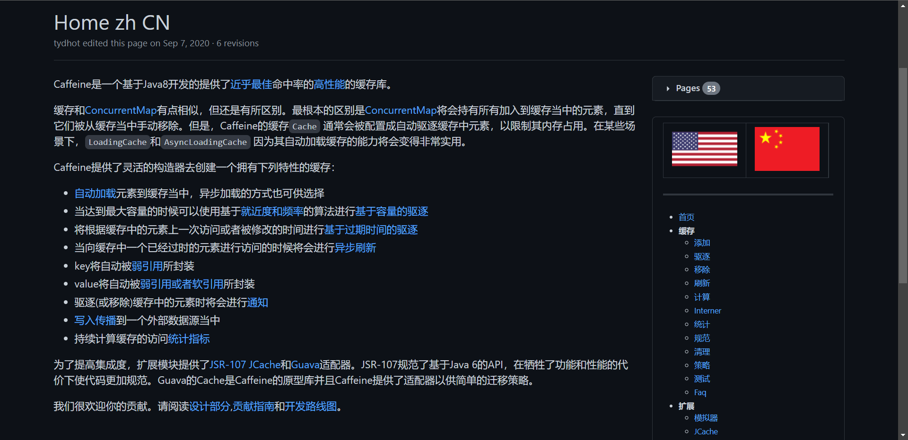
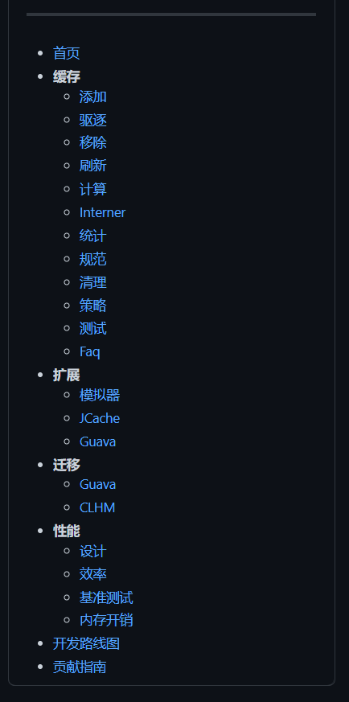

# 多级缓存架构


## 1.什么是多级缓存

传统的缓存策略一般是请求到达Tomcat后，先查询Redis，如果未命中则查询数据库，如图：


存在下面的问题：

•请求要经过Tomcat处理，Tomcat的性能成为整个系统的瓶颈

•Redis缓存失效时，会对数据库产生冲击


多级缓存就是充分利用请求处理的每个环节，分别添加缓存，减轻Tomcat压力，提升服务性能：

- 浏览器访问静态资源时，优先读取浏览器本地缓存
- 访问非静态资源（ajax查询数据）时，访问服务端
- 请求到达Nginx后，优先读取Nginx本地缓存
- 如果Nginx本地缓存未命中，则去直接查询Redis（不经过Tomcat）
- 如果Redis查询未命中，则查询Tomcat
- 请求进入Tomcat后，优先查询JVM进程缓存
- 如果JVM进程缓存未命中，则查询数据库


在多级缓存架构中，Nginx内部需要编写本地缓存查询、Redis查询、Tomcat查询的业务逻辑，因此这样的nginx服务不再是一个**反向代理服务器**，而是一个编写**业务的Web服务器了**。


因此这样的业务Nginx服务也需要搭建集群来提高并发，再有专门的nginx服务来做反向代理，如图：


另外，我们的Tomcat服务将来也会部署为集群模式：


可见，多级缓存的关键有两个：

- 一个是在nginx中编写业务，实现nginx本地缓存、Redis、Tomcat的查询

- 另一个就是在Tomcat中实现JVM进程缓存

其中Nginx编程则会用到OpenResty框架结合Lua这样的语言。


这也是今天课程的难点和重点。


## 2.JVM进程缓存

缓存在日常开发中启动至关重要的作用，由于是存储在内存中，数据的读取速度是非常快的，能大量减少对数据库的访问，减少数据库的压力。我们把缓存分为两类：

- 分布式缓存，例如Redis：
  - 优点：存储容量更大、可靠性更好、可以在集群间共享
  - 缺点：访问缓存有网络开销
  - 场景：缓存数据量较大、可靠性要求较高、需要在集群间共享
- 进程本地缓存，例如HashMap、GuavaCache：
  - 优点：读取本地内存，没有网络开销，速度更快
  - 缺点：存储容量有限、可靠性较低、无法共享
  - 场景：性能要求较高，缓存数据量较小


### 使用Caffeine


**Caffeine**是一个基于Java8开发的，提供了近乎最佳命中率的高性能的本地缓存库。目前Spring内部的缓存使用的就是Caffeine。GitHub地址：https://github.com/ben-manes/caffeine






Caffeine的性能非常好，下图是官方给出的性能对比：


可以看到Caffeine的性能遥遥领先！[caffeine Wiki](https://github.com/ben-manes/caffeine/wiki/Benchmarks-zh-CN)


---


Caffeine既然是缓存的一种，肯定需要有缓存的清除策略，不然的话内存总会有耗尽的时候。

Caffeine提供了三种缓存驱逐策略：

- **基于容量**：设置缓存的数量上限

  ```java
  // 创建缓存对象
  Cache<String, String> cache = Caffeine.newBuilder()
      .maximumSize(1) // 设置缓存大小上限为 1
      .build();
  ```

- **基于时间**：设置缓存的有效时间

  ```java
  // 创建缓存对象
  Cache<String, String> cache = Caffeine.newBuilder()
      // 设置缓存有效期为 10 秒，从最后一次写入开始计时 
      .expireAfterWrite(Duration.ofSeconds(10)) 
      .build();
  
  ```

- **基于引用**：设置缓存为软引用或弱引用，利用GC来回收缓存数据。性能较差，不建议使用。

> **注意**：在默认情况下，当一个缓存元素过期的时候，Caffeine不会自动立即将其清理和驱逐。而是在一次读或写操作后，或者在空闲时间完成对失效数据的驱逐。


**使用 Caffeine 缓存基本API：**

导入坐标:

```xml
<!-- caffeine -->
<dependency>
    <groupId>com.github.ben-manes.caffeine</groupId>
    <artifactId>caffeine</artifactId>
</dependency>
```


Tests:

```java
package com.ganga;

import com.github.benmanes.caffeine.cache.Cache;
import com.github.benmanes.caffeine.cache.Caffeine;
import net.sf.jsqlparser.statement.select.KSQLWindow;
import org.junit.jupiter.api.Test;

import java.util.HashMap;
import java.util.concurrent.TimeUnit;

public class CaffeineTests {


    @Test
    void caffeineCacheTest() {

        //构建一个简单的 Cache 对象
        Cache<String, String> cache = Caffeine.newBuilder().build();

        //添加一个缓存
        cache.put("key1", "Ayaka");

        //获取缓存值 getIfPresent(key)
        //命中：返回值
        String key = cache.getIfPresent("key1");
        //未命中：返回 null
        String key2 = cache.getIfPresent("key2");
        System.out.println("key = " + key);
        System.out.println("key2 = " + key2);

        //使用 get(key,faction->{}) 未命中执行函数添加并返回缓存值
        key2 = cache.get("key2", value -> {
            //未命中查询数据库，执行业务逻辑
            //返回要写入缓存的值
            return "Ayaka的狗🌸";
        });

        System.out.println("key2 = " + key2);

    }


    /*
     基于大小设置驱逐策略：
     */
    @Test
    void testEvictByNum() throws InterruptedException {

        //构建Cache
        Cache<String, String> cache = Caffeine
                .newBuilder()
                .maximumSize(1) //最大缓存量
                .build();

        //写缓存
        cache.put("key1","Ayaka🌸");
        cache.put("key2","Ayaka520");
        cache.put("key3","Ayaka521");

        //等待
        Thread.sleep(20);

        //读缓存
        System.out.println(cache.getIfPresent("key1"));
        System.out.println(cache.getIfPresent("key2"));
        System.out.println(cache.getIfPresent("key3"));

    }


    /*
     基于时间设置驱逐策略：
     */
    @Test
    void testEvictByTime() throws InterruptedException {
        //构建Cache
        Cache<String, String> cache = Caffeine.newBuilder()
                .expireAfterWrite(1, TimeUnit.SECONDS)
                .build();

        //写缓存
        cache.put("key1","Ayaka🌸");
        cache.put("key2","Ayaka520");
        cache.put("key3","Ayaka521");

        //读缓存
        System.out.println(cache.getIfPresent("key1"));
        System.out.println(cache.getIfPresent("key2"));
        System.out.println(cache.getIfPresent("key3"));

        System.out.println("---------------");
        //等待
        Thread.sleep(1200L);
        //读缓存
        System.out.println(cache.getIfPresent("key1"));
        System.out.println(cache.getIfPresent("key2"));
        System.out.println(cache.getIfPresent("key3"));

    }
}
```


### 使用Caffeine实现JVM缓存


在此使用之前我们会进行封装一个Config 将需要的Caffeine缓存放入Spring容器当中

```java
package com.ganga.config;

import com.baomidou.mybatisplus.extension.plugins.pagination.Page;
import com.ganga.pojo.Item;
import com.ganga.pojo.ItemStock;
import com.github.benmanes.caffeine.cache.Cache;
import com.github.benmanes.caffeine.cache.Caffeine;
import org.springframework.context.annotation.Bean;
import org.springframework.context.annotation.Configuration;

import java.util.List;

@Configuration
public class CaffeineConfig {

    /**
     * @return 商品缓存对象
     */
    @Bean
    public Cache<String, Item> itemCache(){
        return Caffeine.newBuilder()
                .initialCapacity(100)
                .maximumSize(10_00)
                .build();
    }

    /**
     * @return 库存缓存对象
     */
    @Bean
    public Cache<String, ItemStock> itemStockCache(){
        return Caffeine.newBuilder()
                .initialCapacity(100)
                .maximumSize(10_000)
                .build();
    }

    /**
     * @return 商品分页缓存
     */
    @Bean
    public Cache<String, Page<Item>> itemListCache(){
        return Caffeine.newBuilder()
                .initialCapacity(50)
                .maximumSize(5_000)
                .build();
    }
}
```

对业务的改造

```java
package com.ganga.controller;

import com.baomidou.mybatisplus.extension.plugins.pagination.Page;
import com.ganga.pojo.Item;
import com.ganga.pojo.ItemStock;
import com.ganga.pojo.PageDTO;
import com.ganga.service.IItemService;
import com.ganga.service.IItemStockService;
import com.github.benmanes.caffeine.cache.Cache;
import org.springframework.beans.factory.annotation.Autowired;
import org.springframework.util.ObjectUtils;
import org.springframework.web.bind.annotation.*;

import java.util.List;
import java.util.stream.Collectors;

import static com.ganga.utils.CaffeineContent.*;

@RestController
@RequestMapping("item")
public class ItemController {

    @Autowired
    private IItemService itemService;
    @Autowired
    private IItemStockService stockService;

    @Autowired
    private Cache<String, Item> itemCache;
    @Autowired
    private Cache<String, ItemStock> itemStockCache;
    @Autowired
    private Cache<String, Page<Item>> itemListCache;

    @GetMapping("list")
    public PageDTO queryItemPage(
            @RequestParam(value = "page", defaultValue = "1") Integer page,
            @RequestParam(value = "size", defaultValue = "5") Integer size) {

        //通过缓存查询
        Page<Item> result = itemListCache.get(CACHE_ITEM_PAGE_KEY + page + ":" + size,
                key -> {
                    // 分页查询商品
                    return itemService.query()
                            .ne("status", 3)
                            .page(new Page<>(page, size));
                });
        if (ObjectUtils.isEmpty(result)){
            return null;
        }

        // 查询库存 返回数据
        List<Item> list = result.getRecords().stream().peek(item -> {
            ItemStock stock = stockService.getById(item.getId());
            item.setStock(stock.getStock());
            item.setSold(stock.getSold());
        }).collect(Collectors.toList());

        // 封装返回
        return new PageDTO(result.getTotal(), list);
    }

    @GetMapping("/{id}")
    public Item findById(@PathVariable("id") Long id) {
        return itemCache.get(CACHE_ITEM_ID_KEY + id,
                key -> itemService.query()
                        .ne("status", 3).eq("id", id)
                        .one()
        );
    }

    @GetMapping("/stock/{id}")
    public ItemStock findStockById(@PathVariable("id") Long id) {
        return itemStockCache.get(CACHE_STOCK_ID_KEY + id, key->stockService.getById(id));
    }
    
    // TODO: 关于缓存的同步

}
```


## 2.OpenResty®


多级缓存的实现离不开 `Nginx` 编程，而 `Nginx` 编程又离不开 `OpenResty` 。


### 安装OpenResty

`OpenResty®` 是一个基于 `Nginx` 的高性能 Web 平台，用于方便地搭建能够处理超高并发、扩展性极高的动态 Web 应用、Web 服务和动态网关。具备下列特点：

- 具备 `Nginx` 的完整功能
- 基于 `Lua` 语言进行扩展，集成了大量精良的 `Lua` 库、第三方模块
- 允许使用`Lua`**自定义业务逻辑**、**自定义库**

官方网站： https://openresty.org/cn/


**这里我们在服务器中安装：**


#### **1）安装开发库**

首先要安装OpenResty的依赖开发库，执行命令：

```sh
yum install -y pcre-devel openssl-devel gcc --skip-broken
```


#### **2）安装OpenResty仓库**

你可以在你的 CentOS 系统中添加 `openresty` 仓库，这样就可以便于未来安装或更新我们的软件包（通过 `yum check-update` 命令）。运行下面的命令就可以添加我们的仓库：

```
yum-config-manager --add-repo https://openresty.org/package/centos/openresty.repo
```


如果提示说命令不存在，则运行：

```
yum install -y yum-utils 
```

然后再重复上面的命令


#### **3）安装OpenResty**

然后就可以像下面这样安装软件包，比如 `openresty`：

```bash
yum install -y openresty
```


#### **4）安装opm工具**

opm是OpenResty的一个管理工具，可以帮助我们安装一个第三方的Lua模块。

如果你想安装命令行工具 `opm`，那么可以像下面这样安装 `openresty-opm` 包：

```bash
yum install -y openresty-opm
```


#### **5）目录结构**

默认情况下，OpenResty安装的目录是：/usr/local/openresty

 

看到里面的nginx目录了吗，OpenResty就是在Nginx基础上集成了一些Lua模块。


#### **6）配置nginx的环境变量**

打开配置文件：

```sh
vi /etc/profile
```

在最下面加入两行：

```sh
export NGINX_HOME=/usr/local/openresty/nginx
export PATH=${NGINX_HOME}/sbin:$PATH
```

NGINX_HOME：后面是OpenResty安装目录下的nginx的目录

然后让配置生效：

```
source /etc/profile
```


### 模块和封装

为了方便使用OpenResty 引入一些不要的依赖 以及 封装一些通用工具


加载OpenResty的lua模块：

```nginx
#lua 模块
lua_package_path "/usr/local/openresty/lualib/?.lua;;";
#c模块     
lua_package_cpath "/usr/local/openresty/lualib/?.so;;";  
```


common.lua

```lua
-- 封装函数，发送http请求，并解析响应
local function read_http(path, params)
    local resp = ngx.location.capture(path,{
        method = ngx.HTTP_GET,
        args = params,
    })
    if not resp then
        -- 记录错误信息，返回404
        ngx.log(ngx.ERR, "http not found, path: ", path , ", args: ", args)
        ngx.exit(404)
    end
    return resp.body
end
-- 将方法导出
local _M = {  
    read_http = read_http
}  
return _M
```


释放Redis连接API：

```lua
-- 关闭redis连接的工具方法，其实是放入连接池
local function close_redis(red)
    local pool_max_idle_time = 10000 -- 连接的空闲时间，单位是毫秒
    local pool_size = 100 --连接池大小
    local ok, err = red:set_keepalive(pool_max_idle_time, pool_size)
    if not ok then
        ngx.log(ngx.ERR, "放入redis连接池失败: ", err)
    end
end
```

读取Redis数据的API：

```lua
-- 查询redis的方法 ip和port是redis地址，key是查询的key
local function read_redis(ip, port, key)
    -- 获取一个连接
    local ok, err = red:connect(ip, port)
    if not ok then
        ngx.log(ngx.ERR, "连接redis失败 : ", err)
        return nil
    end
    -- 查询redis
    local resp, err = red:get(key)
    -- 查询失败处理
    if not resp then
        ngx.log(ngx.ERR, "查询Redis失败: ", err, ", key = " , key)
    end
    --得到的数据为空处理
    if resp == ngx.null then
        resp = nil
        ngx.log(ngx.ERR, "查询Redis数据为空, key = ", key)
    end
    close_redis(red)
    return resp
end
```


开启共享词典：

```nginx
# 共享字典，也就是本地缓存，名称叫做：item_cache，大小150m
lua_shared_dict item_cache 150m; 
```


### 启动和运行


OpenResty底层是基于Nginx的，查看OpenResty目录的nginx目录，结构与windows中安装的nginx基本一致：


所以运行方式与nginx基本一致：

```sh
# 启动nginx
nginx
# 重新加载配置
nginx -s reload
# 停止
nginx -s stop
```


nginx的默认配置文件注释太多，影响后续我们的编辑，这里将nginx.conf中的注释部分删除，保留有效部分。

修改`/usr/local/openresty/nginx/conf/nginx.conf`文件，内容如下：

```nginx
#user  nobody;
worker_processes  1;
error_log  logs/error.log;

events {
    worker_connections  1024;
}

http {
    include       mime.types;
    default_type  application/octet-stream;
    sendfile        on;
    keepalive_timeout  65;

    server {
        listen       8081;
        server_name  localhost;
        location / {
            root   html;
            index  index.html index.htm;
        }
        error_page   500 502 503 504  /50x.html;
        location = /50x.html {
            root   html;
        }
    }
}
```


在Linux的控制台输入命令以启动nginx：

```sh
nginx
```


然后访问页面：http://localhost:8081，注意ip地址替换为你自己的虚拟机IP：


### 使用OpenResty


我们希望达到的多级缓存架构如图：


其中：

- windows上的nginx用来做反向代理服务，将前端的查询商品的ajax请求代理到OpenResty集群

- OpenResty是我们刚刚在服务器 / 虚拟机当中安装的

- OpenResty集群用来编写多级缓存业务


#### 本机Nginx的配置

请求 本机http://localhost:8081/item/10001 ---反向代理到---> OpenResty集群当中

并根据请求路径进行 负载均衡


本机进行反向代理：	

```nginx
#user  nobody;
worker_processes  1;

events {
    worker_connections  1024;
}

http {
    include       mime.types;
    default_type  application/octet-stream;

    sendfile        on;
    #tcp_nopush     on;
    keepalive_timeout  65;

    # OpenResty集群位置，在虚拟机或服务器上
    upstream nginx-cluster{
        # 这里要注意 实现基于ID做负载均衡。而不是交替，这样A中建立的缓存就去A中
        hash $request_uri;
        # 反向代理地址
        server Ayaka520:8081;
        server Ganga520:8081;
        # ......
    }


    server {
        listen       80;
        server_name  localhost;

        # 反向代理 指定OpenResty集群位置
       location /api {
            proxy_pass http://nginx-cluster;
        }

        location / {
            root   html;
            index  index.html index.htm;
        }

        error_page   500 502 503 504  /50x.html;
        location = /50x.html {
            root   html;
        }
    }
}
```


#### OpenResty的Nginx

---

OpenResty的很多功能都依赖于其目录下的Lua库，需要在nginx.conf中指定依赖库的目录，并导入依赖：


1）添加对OpenResty的Lua模块的加载

修改`/usr/local/openresty/nginx/conf/nginx.conf`文件，在其中的http下面，添加下面代码：

```nginx
#lua 模块
lua_package_path "/usr/local/openresty/lualib/?.lua;;";
#c模块     
lua_package_cpath "/usr/local/openresty/lualib/?.so;;";  
```


2）监听/api/item路径

修改`/usr/local/openresty/nginx/conf/nginx.conf`文件，在nginx.conf的server下面，添加对/api/item这个路径的监听：

```nginx
location  /api/item {
    # 默认的响应类型
    default_type application/json;
    # 响应结果由lua/item.lua文件来决定
    content_by_lua_file lua/item.lua;
}
```


这个监听，就类似于SpringMVC中的`@GetMapping("/api/item")`做路径映射。

而`content_by_lua_file lua/item.lua`则相当于调用item.lua这个文件，执行其中的业务，把结果返回给用户。相当于java中调用service。


**`nginx.conf`**

```nginx

worker_processes  1;
error_log  logs/error.log;

events {
    worker_connections  1024;
}

http {
    include       mime.types;
    default_type  application/octet-stream;
    sendfile        on;
    keepalive_timeout  65;
    
    
	# 引入 lua 模块
	lua_package_path "/usr/local/openresty/lualib/?.lua;;";

	# 引入 c   模块     
	lua_package_cpath "/usr/local/openresty/lualib/?.so;;";  


    server {
        listen       8081;
        server_name  localhost;
        
        # 监听/api/item路径 
        location  /api/item {
        
            # 默认的响应类型
            default_type application/json;
            
            # 响应结果由lua/item.lua文件来决定
            content_by_lua_file lua/item.lua;
            
            # 这个监听，就类似于SpringMVC中的`@GetMapping("/api/item")`做路径映射。
            # 而 content_by_lua_file lua/item.lua 则相当于调用item.lua这个文件，执行其中的业务，把结果返回给用户。相当于java中调用service。
        }
        
        error_page   500 502 503 504  /50x.html;
        location = /50x.html {
            root   html;
        }
    }
}        
```


重新加载配置

```sh
nginx -s reload
```


#### 初步编写Lua业务文件


刚刚 `content_by_lua_file lua/item.lua` 是指定的业务Lua文件 


1）在`/usr/loca/openresty/nginx`目录创建文件夹：lua


2）在`/usr/loca/openresty/nginx/lua`文件夹下，新建文件：item.lua


3）编写item.lua，返回假数据

item.lua中，利用ngx.say()函数返回数据到Response中

```lua
ngx.say('{"id":10001,"name":"SALSA AIR","title":"RIMOWA 21寸托运箱拉杆箱 SALSA AIR系列果绿色 820.70.36.4","price":17900,"image":"https://m.360buyimg.com/mobilecms/s720x720_jfs/t6934/364/1195375010/84676/e9f2c55f/597ece38N0ddcbc77.jpg!q70.jpg.webp","category":"拉杆箱","brand":"RIMOWA","spec":"","status":1,"createTime":"2019-04-30T16:00:00.000+00:00","updateTime":"2019-04-30T16:00:00.000+00:00","stock":2999,"sold":31290}')
```


4）重新加载配置

```sh
nginx -s reload
```


#### 请求参数的处理

刚刚返回的是假数据

要想返回真正的商品数据，那么离不开对请求参数的处理 这个参数可能是各种各样的 有get post 路径参数 等等等...

OpenResty中提供了一些API用来获取不同类型的前端请求参数：


在前端发起的ajax请求如图：


可以看到商品id是以路径占位符方式传递的，因此可以利用正则表达式匹配的方式来获取ID


1）获取商品id

修改`/usr/loca/openresty/nginx/nginx.conf`文件中监听/api/item的代码，利用正则表达式获取ID：

```nginx
location ~ /api/item/(\d+) {
    # 默认的响应类型
    default_type application/json;
    # 响应结果由lua/item.lua文件来决定
    content_by_lua_file lua/item.lua;
}
```


2）拼接ID并返回

修改`/usr/loca/openresty/nginx/lua/item.lua`文件，获取id并拼接到结果中返回：

```lua
-- 获取商品id
local id = ngx.var[1]
-- 拼接并返回
ngx.say('{"id":' .. id .. ',"name":"SALSA AIR","title":"RIMOWA 21寸托运箱拉杆箱 SALSA AIR系列果绿色 820.70.36.4","price":17900,"image":"https://m.360buyimg.com/mobilecms/s720x720_jfs/t6934/364/1195375010/84676/e9f2c55f/597ece38N0ddcbc77.jpg!q70.jpg.webp","category":"拉杆箱","brand":"RIMOWA","spec":"","status":1,"createTime":"2019-04-30T16:00:00.000+00:00","updateTime":"2019-04-30T16:00:00.000+00:00","stock":2999,"sold":31290}')
```


3）重新加载并测试

运行命令以重新加载OpenResty配置：

```sh
nginx -s reload
```


TODO


## TODO